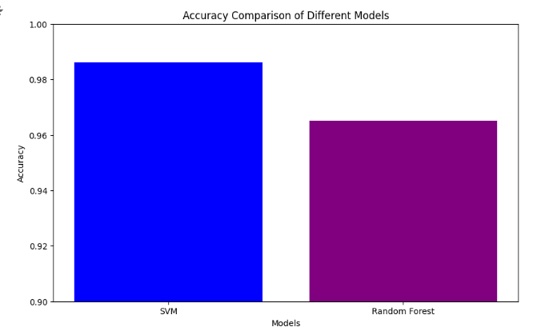
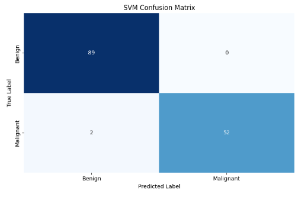
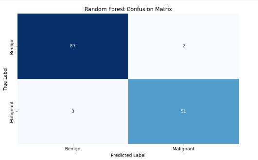

# Breast Cancer Classification Using Machine Learning

## 📌 Project Overview
Breast cancer is one of the most common and life-threatening diseases affecting women worldwide. Early and accurate classification of breast tumors as **Benign** or **Malignant** plays a crucial role in improving survival rates and treatment outcomes.

This project uses **Machine Learning techniques**, specifically **Support Vector Machine (SVM)** and **Random Forest**, to classify breast cancer tumors based on clinical features. The models are trained and evaluated using the **Breast Cancer Wisconsin Dataset**, and their performance is compared using accuracy metrics and confusion matrices.

---

## 🎯 Objectives
- Classify breast cancer tumors as benign or malignant  
- Apply machine learning algorithms for medical diagnosis  
- Compare SVM and Random Forest performance  
- Visualize results using graphs and confusion matrices  

---

## 🧠 Algorithms Used
- Support Vector Machine (SVM)
- Random Forest Classifier

---

## 🧰 Technologies Used
- Python  
- Pandas  
- NumPy  
- Matplotlib  
- Seaborn  
- Scikit-learn  

---

## 📁 Project Structure
```
breast-cancer-classification-ml/
│
├── src/
│ ├── data_preprocessing.py
│ ├── svm_model.py
│ ├── random_forest_model.py
│ └── evaluation.py
│
├── results/
│ ├── accuracy_comparison.png
│ ├── svm_confusion_matrix.png
│ └── rf_confusion_matrix.png
│
├── requirements.txt
├── .gitignore
├── LICENSE
└── README.md
```
---

## 💻 How to Run

### 🧩 Step 1: Clone the repository
```bash
git clone https://github.com/ramavathsrujana/breast-cancer-classification-ml.git
cd breast-cancer-classification-ml
```
### 📦 Step 2: Install dependencies
```bash
pip install -r requirements.txt
```
### 📊 Step 3: Prepare the dataset
```
Download the **Breast Cancer Wisconsin Dataset** and place the CSV file inside a folder named `dataset/`.

Structure:
dataset/
└── data.csv
Dataset Source:
- https://archive.ics.uci.edu/ml/datasets/Breast+Cancer+Wisconsin+(Diagnostic)


```
### 🚀 Step 4: Train models
```bash

The training logic is implemented inside Python modules.

Run the main workflow by importing and executing the functions from these files:
- `data_preprocessing.py`
- `svm_model.py`
- `random_forest_model.py`

```
### 📈 Step 5: Evaluate
```bash
python src/evaluation.py
```
---

## 📊 Results
- SVM Accuracy: ~98.6%  
- Random Forest Accuracy: ~96.5%  

 ### Accuracy Comparison of Models


### Confusion Matrix – SVM Model


### Confusion Matrix – Random Forest Model


---
## 🏁 Conclusion
The project demonstrates that machine learning algorithms, particularly SVM, can effectively assist in early breast cancer detection. Such systems can support healthcare professionals in making accurate diagnostic decisions.

---

## 👩‍💻 Team Members
- Ramavath Srujana  
- Gandla Swathi  
- Chenna Chaitanya  
